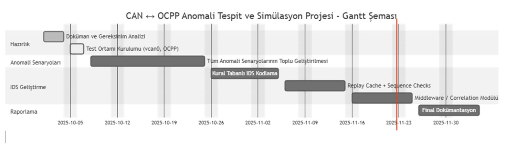
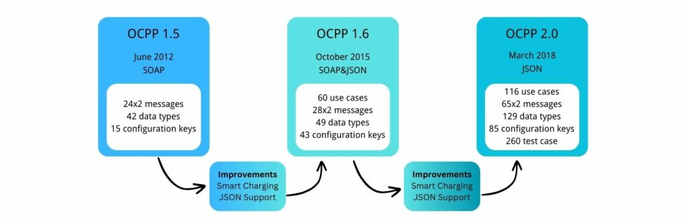
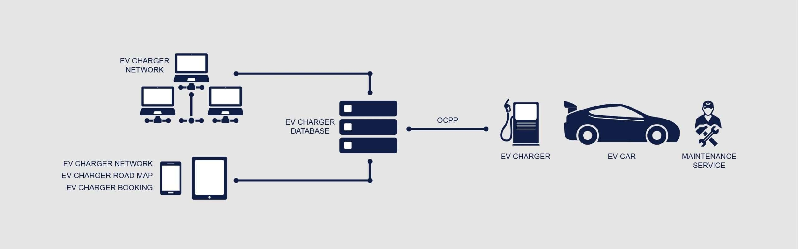

# 🚀 CAN ↔ OCPP Anomali Tespit ve Test Çerçevesi

**Elektrikli Araç Şarj İstasyonları için Yazılım Tabanlı Güvenlik Laboratuvarı**

Bu proje, CAN ↔ OCPP iletişimindeki güvenlik açıklarını test etmek, simüle etmek ve tespit etmek için eksiksiz, modüler bir çerçeve sunar. Eğitim, araştırma ve güvenlik testleri için idealdir.

> ⚙️ **Tamamen Yazılım Tabanlı**: Gerçek donanım gerektirmez - `vcan0` sanal CAN arayüzü ve OCPP WebSocket mock kullanır!

---

## 📋 İçindekiler

- [Hızlı Başlangıç](#-hızlı-başlangıç)
- [Kurulum](#-kurulum)
- [Kullanım](#-kullanım)
- [Anomali Senaryoları](#-anomali-senaryoları)
- [Proje Yapısı](#-proje-yapısı)
- [Dokümantasyon](#-dokümantasyon)

---

## 🎯 Proje Özeti

Bu çerçeve ile yapabilecekleriniz:
- ✅ **10 farklı güvenlik anomalisini** test edin
- ✅ **Gerçekçi CAN ve OCPP trafiği** simüle edin
- ✅ **Kural tabanlı IDS** ile saldırıları tespit edin
- ✅ **EV şarj istasyonu güvenliği** hakkında öğrenin
- ✅ **Yeni tespit yöntemleri** geliştirin

---

---


## ⚡ Hızlı Başlangıç

### 1. Kurulum (5 dakika)

```bash
# Repo dizinine git
cd EV-Charging_Station_Secure

# Sistem paketlerini kur
sudo apt-get update
sudo apt-get install -y can-utils python3-pip

# Python paketlerini kur
pip3 install -r requirements.txt

# vcan0 sanal CAN arayüzünü kur
bash scripts/setup_vcan.sh
```

### 2. İlk Testinizi Çalıştırın (2 dakika)

```bash
# Terminal 1: IDS'i başlat
python3 ids/ids_core.py

# Terminal 2: Frekans sıçraması saldırısını çalıştır
python3 anomalies/01_frequency_spike/test_scenario.py
```

**Beklenen Çıktı:**
```
⚠️  ANOMALİ 1: CAN ID 0x9FF üzerinde frekans sıçraması tespit edildi - 100.0 msg/s
🚨 GÜVENLİK YANITI TETİKLENDİ 🚨
```

🎉 **Tebrikler!** İlk anomali testinizi başarıyla çalıştırdınız!

---

## 🛠️ Kurulum

### Sistem Gereksinimleri

- **İşletim Sistemi**: Linux (Ubuntu 20.04+, Debian 11+ önerilir)
- **Python**: 3.7 veya üzeri
- **Yetki**: sudo erişimi (vcan kurulumu için)
- **Disk Alanı**: ~100 MB

### Adım 1: Sistem Paketlerini Kurun

```bash
# Paket listesini güncelle
sudo apt-get update

# CAN araçlarını kur
sudo apt-get install -y can-utils

# Python ve pip'i kur (eğer yoksa)
sudo apt-get install -y python3 python3-pip

# Kurulumu doğrula
which candump  # CAN araçlarının yolunu gösterir
python3 --version  # Python 3.7+ olmalı
```

### Adım 2: Python Bağımlılıklarını Kurun

```bash
# Proje dizinine git
cd EV-Charging_Station_Secure

# Gerekli Python paketlerini kur
pip3 install -r requirements.txt

# Kurulumu doğrula
python3 -c "import can; print('✅ python-can kuruldu')"
python3 -c "import websockets; print('✅ websockets kuruldu')"
```

### Adım 3: vcan0 Sanal CAN Arayüzünü Kurun

```bash
# Otomatik kurulum scripti
bash scripts/setup_vcan.sh

# Doğrulama
ip link show vcan0
```

Beklenen çıktı:
```
vcan0: <NOARP,UP,LOWER_UP> mtu 72 qdisc noqueue state UNKNOWN
```

---

---

### Sorun Giderme

**vcan0 bulunamadı hatası:**
```bash
sudo modprobe vcan
sudo ip link add dev vcan0 type vcan
sudo ip link set up vcan0
```

**Python paket hatası:**
```bash
# Sanal ortam kullanın
python3 -m venv venv
source venv/bin/activate
pip install -r requirements.txt
```

Detaylı kurulum için: [docs/SETUP.md](docs/SETUP.md)

---

---

## 📖 Kullanım

### Temel Kullanım Akışı

1. **IDS'i Başlat** (Terminal 1)
2. **Anomali Testini Çalıştır** (Terminal 2)
3. **Logları İncele**

### Örnek: Anomali Testi Çalıştırma

#### Anomali 1: Frekans Sıçraması

```bash
# Terminal 1: IDS'i başlat
python3 ids/ids_core.py

# Terminal 2: Saldırıyı simüle et
python3 anomalies/01_frequency_spike/test_scenario.py

# Terminal 3: Logları izle (opsiyonel)
tail -f logs/ids_alerts.log
```

#### Anomali 5: OCPP Bypass

```bash
# Terminal 1: IDS
python3 ids/ids_core.py

# Terminal 2: Bypass saldırısı
python3 anomalies/05_ocpp_bypass/test_scenario.py
```

#### Anomali 9: Firmware Uyuşmazlığı

```bash
# Tek komutla çalıştır (IDS içinde)
python3 anomalies/09_firmware_mismatch/test_scenario.py
```

### Tüm Testleri Sırayla Çalıştırma

```bash
# IDS'i arka planda başlat
python3 ids/ids_core.py &
IDS_PID=$!

# Tüm anomalileri test et
for i in 01 02 03 04 05 06 07 08 09 10; do
    echo "=== Anomali $i Test Ediliyor ==="
    python3 anomalies/${i}_*/test_scenario.py
    sleep 3
done

# IDS'i durdur
kill $IDS_PID
```

### Logları İnceleme

```bash
# IDS alarm logları
cat logs/ids_alerts.log

# IDS istatistikleri
cat logs/ids_stats.json

# CAN trafik logları
cat logs/can_traffic.log
```

### CAN Trafiğini İzleme

```bash
# Tüm CAN mesajlarını izle
candump vcan0

# Manuel CAN mesajı gönder
cansend vcan0 123#DEADBEEF
```

Detaylı kullanım için: [docs/RUNBOOK.md](docs/RUNBOOK.md)

---

## 🔥 Anomali Senaryoları

Toplam **10 güvenlik anomalisi** uygulanmıştır:

| # | Anomali | Açıklama | Risk | Test Komutu |
|---|---------|----------|------|-------------|
| 1 | **Frekans Sıçraması** | CAN ID 0x9FF'de 100 msg/s | 🔴 YÜKSEK | `python3 anomalies/01_frequency_spike/test_scenario.py` |
| 2 | **OCPP → CAN Gecikmesi** | RemoteStart sonrası 10s gecikme | 🟡 ORTA | `python3 anomalies/02_ocpp_can_delay/test_scenario.py` |
| 3 | **Aralık Dışı Değer** | 255A akım (max 80A) | 🟠 ORTA-YÜKSEK | `python3 anomalies/03_out_of_range_payload/test_scenario.py` |
| 4 | **MeterValues Frekans** | 1 Hz → 2 Hz | 🟡 ORTA | `python3 anomalies/04_metervalues_rate_doubling/test_scenario.py` |
| 5 | **OCPP Bypass** | OCPP olmadan CAN komutu | 🔴 KRİTİK | `python3 anomalies/05_ocpp_bypass/test_scenario.py` |
| 6 | **Hata Patlaması** | 50 hata mesajı/saniye | 🔴 YÜKSEK | `python3 anomalies/06_error_burst/test_scenario.py` |
| 7 | **WebSocket Seli** | 100 bağlantı/5 saniye | 🔴 KRİTİK | `python3 anomalies/07_websocket_flood/test_scenario.py` |
| 8 | **Hayalet Ölçüm** | 0 → 50 kWh ani sıçrama | 🔴 YÜKSEK | `python3 anomalies/08_ghost_measurement/test_scenario.py` |
| 9 | **Firmware Uyuşmazlığı** | Yetkisiz firmware | 🔴 KRİTİK | `python3 anomalies/09_firmware_mismatch/test_scenario.py` |
| 10 | **Tekrar Saldırısı** | Aynı mesajın 5 kez tekrarı | 🔴 YÜKSEK | `python3 anomalies/10_replay_attack/test_scenario.py` |

Her anomali için detaylı açıklama: `anomalies/XX_*/README.md`

---

## 📁 Proje Yapısı

```
EV-Charging_Station_Secure/
├── 📂 can/                     # CAN bus araçları ve simülatör
│   ├── can_utils.py           # CAN arayüz yönetimi
│   ├── can_simulator.py       # Trafik simülatörü
│   └── README.md
├── 📂 ocpp/                    # OCPP mock bileşenleri
│   ├── ocpp_server.py         # Mock OCPP sunucusu
│   ├── ocpp_client.py         # Mock OCPP istemcisi
│   ├── ocpp_messages.py       # Mesaj şablonları
│   └── README.md
├── 📂 anomalies/               # 10 anomali test senaryosu
│   ├── 01_frequency_spike/    # Her anomali için:
│   │   ├── README.md          #   - Açıklama
│   │   ├── config.json        #   - Konfigürasyon
│   │   ├── test_scenario.py   #   - Test scripti
│   │   └── expected_output.txt#   - Beklenen sonuç
│   ├── 02_ocpp_can_delay/
│   ├── ... (03-10)
│   └── 10_replay_attack/
├── 📂 ids/                     # Saldırı Tespit Sistemi
│   ├── ids_core.py            # Ana IDS motoru
│   ├── rules.py               # 10 anomali dedektörü
│   ├── alerts.py              # Loglama ve alarm sistemi
│   └── README.md
├── 📂 scripts/                 # Yardımcı scriptler
│   └── setup_vcan.sh          # vcan0 kurulum scripti
├── 📂 docs/                    # Dokümantasyon
│   ├── RUNBOOK.md             # Kullanım kılavuzu
│   └── SETUP.md               # Kurulum rehberi
├── 📂 logs/                    # Log dosyaları
├── 📂 archive/                 # Eski dosyalar
├── 📂 assets/                  # Görseller
├── requirements.txt            # Python bağımlılıkları
└── README.md                   # Bu dosya
```

---

## 📚 Dokümantasyon

### Ana Dokümantasyon
- **[RUNBOOK.md](docs/RUNBOOK.md)** - Adım adım kullanım kılavuzu
- **[SETUP.md](docs/SETUP.md)** - Detaylı kurulum rehberi

### Bileşen Dokümantasyonu
- **[CAN Araçları](can/README.md)** - CAN bus kullanımı
- **[OCPP Bileşenleri](ocpp/README.md)** - OCPP mock kullanımı
- **[IDS Sistemi](ids/README.md)** - IDS yapılandırması

### Anomali Dokümantasyonu
Her anomali için `anomalies/XX_*/README.md` dosyasında:
- Teknik açıklama
- Güvenlik etkisi
- Tespit yöntemi
- Kullanım talimatları

---

## 🎓 Kullanım Senaryoları

### Eğitim
- Üniversite derslerinde IoT/otomotiv güvenliği öğretimi
- Workshop ve seminerler
- Öğrenci projeleri ve ödevler

### Araştırma
- IDS algoritmaları geliştirme
- Anomali tespit yöntemleri araştırması
- Makine öğrenmesi uygulamaları

### Güvenlik Testi
- Penetrasyon testi pratiği
- Güvenlik açığı analizi
- Savunma stratejileri geliştirme

---

## 🏗️ Mimari

```
┌─────────────────┐         ┌──────────────────┐
│  OCPP Client    │◄───────►│  OCPP Server     │
│  (Şarj İstasyon)│         │  (Merkez Sistem) │
└────────┬────────┘         └────────┬─────────┘
         │                           │
         │    WebSocket (Port 9000)  │
         │                           │
         └───────────┬───────────────┘
                     │
              ┌──────▼──────┐
              │     IDS     │
              │   İzleme    │
              └──────┬──────┘
                     │
         ┌───────────▼───────────┐
         │    CAN Bus (vcan0)    │
         │  ┌─────────────────┐  │
         │  │  0x100  0x200   │  │
         │  │  0x300  0x9FF   │  │
         │  │  0x301  0x400   │  │
         │  └─────────────────┘  │
         └───────────────────────┘
```

---

## 🤝 Ekip Üyeleri

- 230541102 Muhammet Enes AYDIN
- 230541146 Emre AŞKIN
- 230541074 Anıl Gökhan YILMAZ
- 230541052 Muhammed Fatih SALTAN
- 230541120 Ömer Yiğit AVŞAR
- 220541601 Abdulkarim haj amin
- 230541089 Muhammet Hasan UYAR
- 240541164 Sabri Baz

---

## 📝 Lisans ve Sorumluluk Reddi

Bu proje **yalnızca eğitim ve araştırma amaçlıdır**. Gerçek üretim sistemlerinde veya altyapılarda uygun yetkilendirme olmadan kullanmayın.

---

## 🔗 Ek Kaynaklar

- **PDF Rapor**: `Can-ocpp Anomali Raporu.pdf`
- **Sunum**: `Sunum - Siber Güvenlik ve Anomali Tespiti.pdf`
- **Uygulama Planı**: Artifact dizininde

---

## 🚀 Gelecek Geliştirmeler

- [ ] Makine öğrenmesi tabanlı anomali tespiti
- [ ] Gerçek zamanlı izleme dashboard'u
- [ ] Gerçek OCPP sunucusu entegrasyonu
- [ ] Donanım CAN adaptör desteği
- [ ] Otomatik test suite
- [ ] Performans metrikleri ve raporlama

---

## 💡 Sık Sorulan Sorular

**S: Gerçek donanım gerekli mi?**  
C: Hayır, tamamen yazılım tabanlıdır. vcan0 sanal CAN arayüzü kullanır.

**S: Hangi işletim sistemlerinde çalışır?**  
C: Linux (Ubuntu, Debian, Fedora vb.). Windows WSL2'de de çalışabilir.

**S: Python sürümü önemli mi?**  
C: Evet, Python 3.7 veya üzeri gereklidir.

**S: Testler gerçek şarj istasyonlarına zarar verir mi?**  
C: Hayır, tamamen izole sanal ortamda çalışır.

---

## 📞 Destek

Sorunlar veya sorular için:
1. [docs/RUNBOOK.md](docs/RUNBOOK.md) sorun giderme bölümünü kontrol edin
2. Her anomali için README dosyalarını inceleyin
3. `logs/` dizinindeki log dosyalarını kontrol edin

---

**Başarılar! 🎉**

Detaylı kullanım talimatları için [RUNBOOK](docs/RUNBOOK.md) dosyasını okuyun.

### Ekip Üyeleri
- 230541102 Muhammet Enes AYDIN
- 230541146 Emre AŞKIN
- 230541074 Anıl Gökhan YILMAZ
- 230541052 Muhammed Fatih Saltan
- 230541120 Ömer Yiğit AVŞAR
- 230541052 Muhammed Fatih SALTAN
- 220541601 Abdulkarim haj amin
- 230541089 Muhammet Hasan UYAR
- 240541164 Sabri Baz

